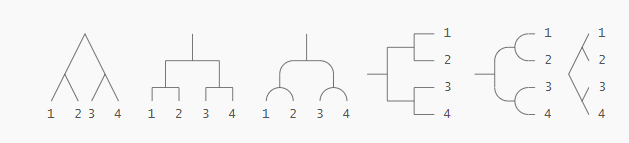
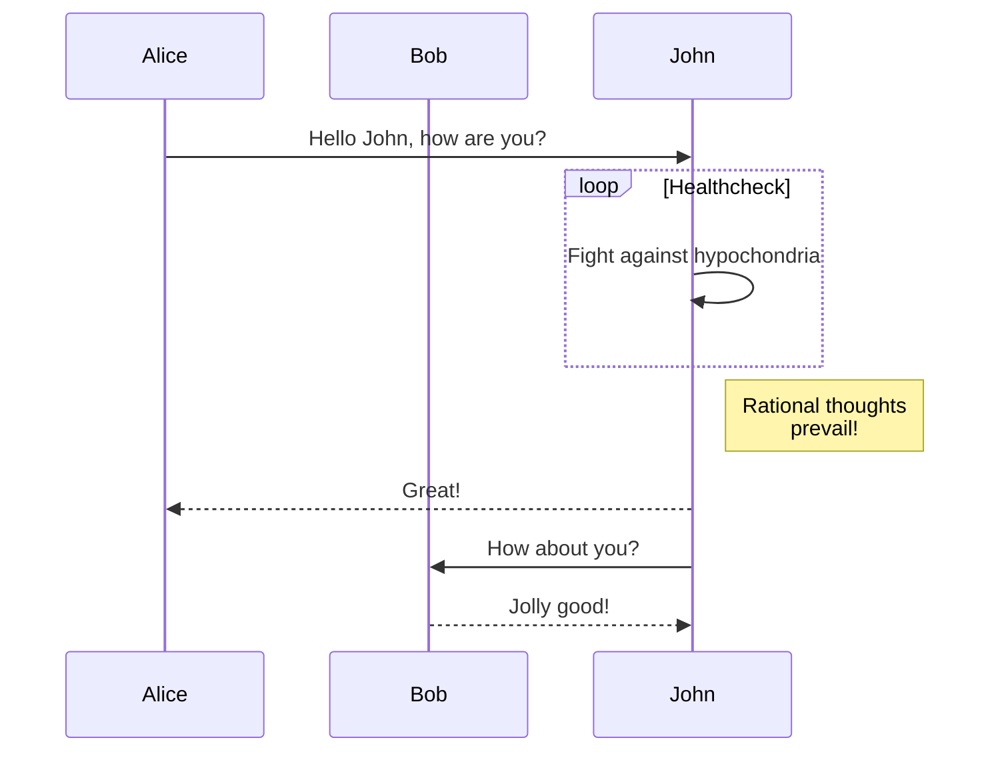
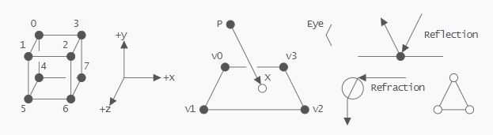
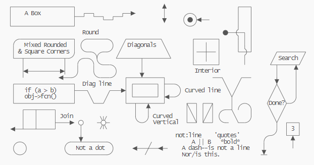
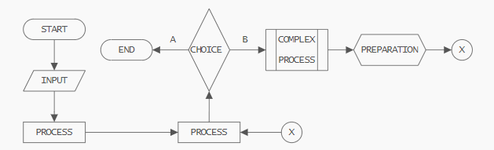
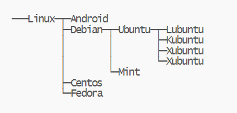
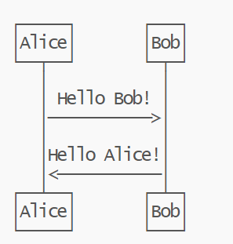
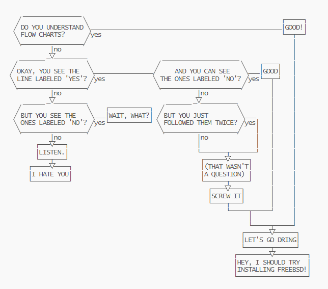
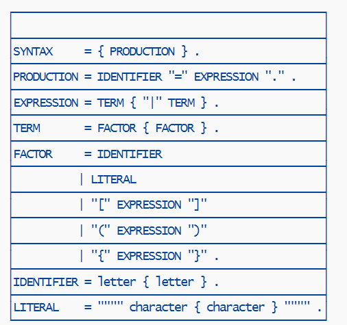

+++
title = "图表"
weight = 4
date = 2023-05-18T17:03:08+08:00
description = ""
isCJKLanguage = true
draft = false
+++

# Diagrams

Use fenced code blocks and markdown render hooks to display diagrams.

[New in v0.93.0](https://github.com/gohugoio/hugo/releases/tag/v0.93.0)

## GoAT Diagrams (Ascii) 

Hugo supports [GoAT](https://github.com/bep/goat) natively. This means that this code block:

~~~txt
```goat
      .               .                .               .--- 1          .-- 1     / 1
     / \              |                |           .---+            .-+         +
    /   \         .---+---.         .--+--.        |   '--- 2      |   '-- 2   / \ 2
   +     +        |       |        |       |    ---+            ---+          +
  / \   / \     .-+-.   .-+-.     .+.     .+.      |   .--- 3      |   .-- 3   \ / 3
 /   \ /   \    |   |   |   |    |   |   |   |     '---+            '-+         +
 1   2 3   4    1   2   3   4    1   2   3   4         '--- 4          '-- 4     \ 4

```
~~~

Will be rendered as:



## Mermaid Diagrams 

Hugo currently does not provide default templates for Mermaid diagrams. But you can easily add your own. One way to do it would be to create `layouts/_default/_markup/render-codeblock-mermaid.html`:

```go-html-template
<div class="mermaid">
  {{- .Inner | safeHTML }}
</div>
{{ .Page.Store.Set "hasMermaid" true }}
```

And then include this snippet at the bottom of the content template (**Note**: below `.Content` as the render hook is not processed until `.Content` is executed):

```go-html-template
{{ if .Page.Store.Get "hasMermaid" }}
  <script type="module">
    import mermaid from 'https://cdn.jsdelivr.net/npm/mermaid/dist/mermaid.esm.min.mjs';
    mermaid.initialize({ startOnLoad: true });
  </script>
{{ end }}
```

With that you can use the `mermaid` language in Markdown code blocks:

````

````

## Goat Ascii Diagram Examples 

### Graphics 



### Complex 



### Process 



### File tree 

Created from https://arthursonzogni.com/Diagon/#Tree



### Sequence Diagram 

https://arthursonzogni.com/Diagon/#Sequence



### Flowchart 

https://arthursonzogni.com/Diagon/#Flowchart



### Table 

https://arthursonzogni.com/Diagon/#Table


