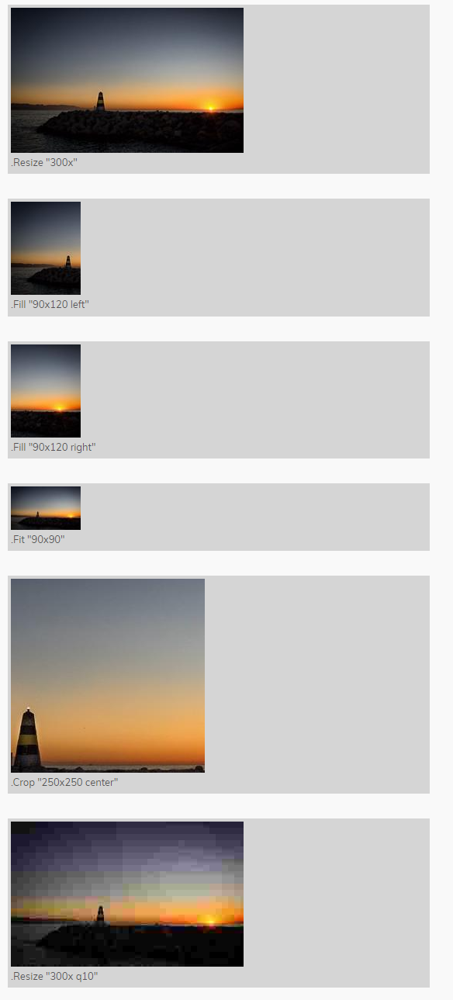
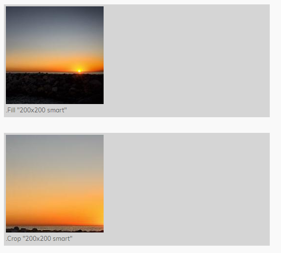

+++
title = "图像处理"
weight = 8
date = 2023-05-18T17:03:08+08:00
description = ""
isCJKLanguage = true
draft = false
+++

# Image Processing - 图像处理 

[https://gohugo.io/content-management/image-processing/](https://gohugo.io/content-management/image-processing/)

​	调整大小、裁剪、旋转、滤镜和转换图像。 

## 图像资源 

​	要处理图像，必须将其作为页面资源或全局资源访问。

### 页面资源 

​	页面资源是[page bundle](https://gohugo.io/content-management/page-bundles)中的文件。page bundle是一个在其根目录下具有`index.md`或`_index.md`文件的目录。

```text
content/
└── posts/
    └── post-1/           <-- page bundle
        ├── index.md
        └── sunset.jpg    <-- page resource
```

### 全局资源 

​	全局资源是一个文件：

- 在`assets`目录中，或 
- 在任何[已挂载](https://gohugo.io/hugo-modules/configuration#module-config-mounts)到`assets`目录的目录中，或 
- 位于通过`http`或`https`可访问的远程服务器上 

```text
assets/
└── images/
    └── sunset.jpg    <-- global resource
```

​	要访问本地图像作为全局资源：

```go-html-template
{{ $image := resources.Get "images/sunset.jpg" }}
```

​	要将远程图像作为全局资源访问：

```go-html-template
{{ $image := resources.GetRemote "https://gohugo.io/img/hugo-logo.png" }}
```

## 图像渲染 

​	一旦您已经将图像作为页面资源或全局资源之一访问，可以使用`Permalink`、`RelPermalink`、`Width`和`Height`属性在模板中呈现它。

示例1：如果未找到资源，则会引发错误。

```go-html-template
{{ $image := .Resources.GetMatch "sunset.jpg" }}

```

示例2：如果未找到资源，则跳过图像渲染。

```go-html-template
{{ $image := .Resources.GetMatch "sunset.jpg" }}
{{ with $image }}
  
{{ end }}
```

示例3：如果未找到资源，则跳过图像渲染的更简洁的方法。

```go-html-template
{{ with .Resources.GetMatch "sunset.jpg" }}
  
{{ end }}
```

## 图像处理方法 

​	`image`资源实现了`Resize`、`Fit`、`Fill`、`Crop`、`Filter`、`Colors`和`Exif`方法。

Metadata (Exif, IPTC, XMP, etc.) is not preserved during image transformation. Use the [`Exif`] method with the *original* image to extract Exif metadata from JPEG or TIFF images.

> ​	在图像转换期间，元数据（Exif，IPTC，XMP等）不会被保留。请使用[`Exif`]方法和原始图像从JPEG或TIFF图像中提取Exif元数据。

### Resize 

​	将图像调整为指定的宽度和/或高度。

​	如果同时指定宽度和高度，则结果图像将不成比例缩放，除非原始图像具有相同的宽高比。

```go-html-template
{{/* Resize to a width of 600px and preserve aspect ratio */}}
{{ $image := $image.Resize "600x" }}

{{/* Resize to a height of 400px and preserve aspect ratio */}}
{{ $image := $image.Resize "x400" }}

{{/* Resize to a width of 600px and a height of 400px */}}
{{ $image := $image.Resize "600x400" }}
```

### Fit 

​	按比例缩小图像以适应给定的尺寸。您必须同时提供宽度和高度。

```go-html-template
{{ $image := $image.Fit "600x400" }}
```

### Fill 

​	裁剪并调整图像以匹配给定的尺寸。您必须同时提供宽度和高度。使用 `anchor` 选项可以更改裁剪框锚点。

```go-html-template
{{ $image := $image.Fill "600x400" }}
```

### Crop 

​	裁剪图像以匹配给定的尺寸而不调整大小。您必须同时提供宽度和高度。使用 `anchor` 选项可以更改裁剪框锚点。

```go-html-template
{{ $image := $image.Crop "600x400" }}
```

### Filter 

​	对图像应用一个或多个[滤镜](https://gohugo.io/functions/images)。

```go-html-template
{{ $image := $image.Filter (images.GaussianBlur 6) (images.Pixelate 8) }}
```

​	使用管道以更函数式的风格编写此内容。 Hugo按照给定的顺序应用过滤器。

```go-html-template
{{ $image := $image | images.Filter (images.GaussianBlur 6) (images.Pixelate 8) }}
```

​	有时候创建一个过滤器链并重复使用它是很有用的。

```go-html-template
{{ $filters := slice  (images.GaussianBlur 6) (images.Pixelate 8) }}
{{ $image1 := $image1.Filter $filters }}
{{ $image2 := $image2.Filter $filters }}
```

### Colors 

[New in v0.104.0](https://github.com/gohugoio/hugo/releases/tag/v0.104.0)

​	`.Colors` 方法使用简单的直方图方法返回图像中的主要颜色的十六进制字符串切片。

```go-html-template
{{ $colors := $image.Colors }}
```

​	此方法速度很快，但如果您还缩小图像，从缩小的图像提取颜色可提高性能。

### Exif 

​	提供一个包含图像元数据的 [Exif](https://en.wikipedia.org/wiki/Exif) 对象。

​	您可以访问 JPEG 和 TIFF 图像中的 Exif 数据。为避免处理没有 Exif 数据的图像时出现错误，请将访问包装在 `with` 语句中。

```go-html-template
{{ with $image.Exif }}
  Date: {{ .Date }}
  Lat/Long: {{ .Lat }}/{{ .Long }}
  Tags:
  {{ range $k, $v := .Tags }}
    TAG: {{ $k }}: {{ $v }}
  {{ end }}
{{ end }}
```

​	您还可以使用`lang.FormatNumber`函数单独访问Exif字段，根据需要格式化字段。

```go-html-template
{{ with $image.Exif }}
  <ul>
    {{ with .Date }}<li>Date: {{ .Format "January 02, 2006" }}</li>{{ end }}
    {{ with .Tags.ApertureValue }}<li>Aperture: {{ lang.FormatNumber 2 . }}</li>{{ end }}
    {{ with .Tags.BrightnessValue }}<li>Brightness: {{ lang.FormatNumber 2 . }}</li>{{ end }}
    {{ with .Tags.ExposureTime }}<li>Exposure Time: {{ . }}</li>{{ end }}
    {{ with .Tags.FNumber }}<li>F Number: {{ . }}</li>{{ end }}
    {{ with .Tags.FocalLength }}<li>Focal Length: {{ . }}</li>{{ end }}
    {{ with .Tags.ISOSpeedRatings }}<li>ISO Speed Ratings: {{ . }}</li>{{ end }}
    {{ with .Tags.LensModel }}<li>Lens Model: {{ . }}</li>{{ end }}
  </ul>
{{ end }}
```

#### Exif变量 

- .Date

  图像创建日期/时间。使用[time.Format](https://gohugo.io/functions/dateformat)函数格式化。 

- .Lat

  GPS纬度（latitude 以度为单位）。 

- .Long

  GPS经度（longitude  以度为单位）。 

- .Tags

  此图像可用的Exif标签集合。您可以在[站点配置](https://gohugo.io/content-management/image-processing/#exif-data)中包含或排除特定标签。

## 图像处理选项 

​	`Resize`、`Fit`、`Fill`和`Crop`方法接受一个以空格分隔、大小写不敏感的选项列表。列表中的选项顺序无关紧要。

### 尺寸

​	使用`Resize`方法，必须指定宽度、高度或两者。`Fit`、`Fill`和`Crop`方法需要宽度和高度。所有尺寸以像素为单位。

```go-html-template
{{ $image := $image.Resize "600x" }}
{{ $image := $image.Resize "x400" }}
{{ $image := $image.Resize "600x400" }}
{{ $image := $image.Fit "600x400" }}
{{ $image := $image.Fill "600x400" }}
{{ $image := $image.Crop "600x400" }}
```

### 旋转

​	将图像逆时针旋转给定角度。 Hugo在缩放之前执行旋转。例如，如果原始图像为600x400，并且您希望将图像逆时针旋转90度，并将其缩小50%：

```go-html-template
{{ $image = $image.Resize "200x r90" }}
```

​	在上面的示例中，宽度表示旋转后的期望宽度。

​	要在不缩放的情况下旋转图像，请使用原始图像的尺寸：

```go-html-template
{{ with .Resources.GetMatch "sunset.jpg" }}
  {{ with .Resize (printf "%dx%d r90" .Height .Width) }}
    
  {{ end }}
{{ end }}
```

​	在上面的示例中，第二行我们反转了宽度和高度，以反映旋转后期望尺寸。

### 锚点 

​	使用`Crop`或`Fill`方法时，锚点确定裁剪框的放置位置。您可以指定`TopLeft`、`Top`、`TopRight`、`Left`、`Center`、`Right`、`BottomLeft`、`Bottom`、`BottomRight`或`Smart`。

​	默认值为`Smart`，它使用[Smartcrop](https://github.com/muesli/smartcrop#smartcrop)图像分析来确定裁剪框的最佳放置位置。您可以在[站点配置](https://gohugo.io/content-management/image-processing/#processing-options)中覆盖默认值。

​	例如，如果您有一个400x200像素的图像，其中鸟位于左上象限，您可以创建一个包含鸟的200x100缩略图：

```go-html-template
{{ $image.Crop "200x100 TopLeft" }}
```

​	如果在使用`Crop`或`Fill`方法时应用[旋转](https://gohugo.io/content-management/image-processing/#rotation)，则相对于旋转后的图像指定锚点。

### 目标格式 

​	默认情况下，Hugo将图像编码为源格式。您可以通过指定`bmp`、`gif`、`jpeg`、`jpg`、`png`、`tif`、`tiff`或`webp`将图像转换为另一种格式。

```go-html-template
{{ $image.Resize "600x webp" }}
```

​	使用原始图像的尺寸而不缩放来转换图像：

```go-html-template
{{ with .Resources.GetMatch "sunset.jpg" }}
  {{ with .Resize (printf "%dx%d webp" .Width .Height) }}
    
  {{ end }}
{{ end }}
```

### 质量 

​	适用于JPEG和WebP图像，`q`值确定转换图像的质量。更高的值会产生更好的质量图像，而更低的值会产生更小的文件。将此值设置为介于1和100之间（包括1和100）的整数。

​	默认值为75。您可以在[站点配置](https://gohugo.io/content-management/image-processing/#processing-options)中覆盖默认值。

```go-html-template
{{ $image.Resize "600x webp q50" }}
```

### 提示

​	适用于WebP图像，此选项对应于一组预定义的编码参数。

| Value     | Example                |
| :-------- | :--------------------- |
| `drawing` | 高对比度手绘或线描图像 |
| `icon`    | 小型彩色图像           |
| `photo`   | 自然光照的户外照片     |
| `picture` | 室内照片，例如肖像     |
| `text`    | 主要是文本的图像       |

​	默认值为`photo`。您可以在[站点配置](https://gohugo.io/content-management/image-processing/#processing-options)中覆盖默认值。

```go-html-template
{{ $image.Resize "600x webp picture" }}
```

### 背景色 

​	当将支持透明度的图像（例如PNG）转换为不支持透明度的图像（例如JPEG）时，可以指定结果图像的背景颜色。

​	使用3位或6位十六进制颜色代码（例如`#00f`或`#0000ff`）。

​	默认值为`#ffffff`（白色）。您可以在[站点配置](https://gohugo.io/content-management/image-processing/#processing-options)中覆盖默认值。

```go-html-template
{{ $image.Resize "600x jpg #b31280" }}
```

### 重采样滤镜 

You may specify the resampling filter used when resizing an image. Commonly used resampling filters include:

您可以在调整图像大小时指定使用的重采样滤镜。常用的重采样滤镜包括：

调整图像大小时，可以指定所使用的重采样滤镜。常用的重采样滤镜包括：

| Filter              | Description                                                |
| :------------------ | :--------------------------------------------------------- |
| `Box`               | 适合缩小的简单快速平均滤镜                                 |
| `Lanczos`           | 用于摄影图像的高质量重采样滤镜，产生锐利的结果             |
| `CatmullRom`        | 尖锐的立方滤镜，比Lanczos滤镜快，提供类似的结果            |
| `MitchellNetravali` | 立方体滤镜，产生比 CatmullRom 更平滑的结果，减少了环状伪影 |
| `Linear`            | 双线性重采样滤镜，产生平滑的输出，比立方体滤镜更快         |
| `NearestNeighbor`   | 最快的重采样滤镜，无抗锯齿                                 |

​	默认值为 `Box`。您可以在[站点配置](https://gohugo.io/content-management/image-processing/#processing-options)中覆盖默认值。

```go-html-template
{{ $image.Resize "600x400 Lanczos" }}
```

​	请参见[github.com/disintegration/imaging](https://github.com/disintegration/imaging#image-resizing)以获取完整的重采样滤镜列表。如果您希望以性能为代价改善图像质量，可以尝试使用替代滤镜。

## 图像处理示例 

​	以下示例中使用的日落照片版权归[Bjørn Erik Pedersen](https://commons.wikimedia.org/wiki/User:Bep)所有（Creative Commons Attribution-Share Alike 4.0 International license）。



​	这是用于生成上述示例的shortcode ：

layouts/shortcodes/imgproc.html

```go-html-template
{{ $img := .Page.Resources.GetMatch (printf "*%s*" (.Get 0)) }}
{{ $command := .Get 1 }}
{{ $options := .Get 2 }}
{{ if eq $command "Fit"}}
  {{ $img = $img.Fit $options }}
{{ else if eq $command "Resize"}}
  {{ $img = $img.Resize $options }}
{{ else if eq $command "Fill"}}
  {{ $img = $img.Fill $options }}
{{ else if eq $command "Crop"}}
  {{ $img = $img.Crop $options }}
{{ else }}
  {{ errorf "Invalid image processing command: Must be one of Crop, Fit, Fill or Resize."}}
{{ end }}
<figure style="padding: 0.25rem; margin: 2rem 0; background-color: #cccc">
  
  <figcaption>
  <small>
    {{ with .Inner }}
      {{ . }}
    {{ else }}
      .{{ $command }} "{{ $options }}"
    {{ end }}
  </small>
  </figcaption>
</figure>
```

​	在您的Markdown中像这样调用shortcode ：

```go-html-template
\{\{\< imgproc sunset Resize "300x" /\>\}\}
```

> ​	注意上面自我封闭的shortcode语法。您可以使用或不使用内部内容来调用`imgproc` shortcode 。

## 图像处理配置 

### 处理选项 

​	在您的站点配置中定义一个`imaging`处理部分，以设置默认的[图像处理选项](https://gohugo.io/content-management/image-processing/#image-processing-options)。

config.

=== "yaml"

    ``` yaml
    imaging:
      anchor: Smart
      bgColor: '#ffffff'
      hint: photo
      quality: 75
      resampleFilter: Box
    ```

=== "toml"

    ``` toml
    [imaging]
      anchor = 'Smart'
      bgColor = '#ffffff'
      hint = 'photo'
      quality = 75
      resampleFilter = 'Box'
    ```

=== "json"

    ``` json
    {
       "imaging": {
          "anchor": "Smart",
          "bgColor": "#ffffff",
          "hint": "photo",
          "quality": 75,
          "resampleFilter": "Box"
       }
    }
    ```

- anchor

  参见图像处理选项：[锚点](https://gohugo.io/content-management/image-processing/#anchor)。 

- bgColor

  See image processing options: [background color](https://gohugo.io/content-management/image-processing/#background-color).

  参见图像处理选项：[背景色](https://gohugo.io/content-management/image-processing/#background-color)。 

- hint

  参见图像处理选项：[提示](https://gohugo.io/content-management/image-processing/#hint)。 

- quality

  参见图像处理选项：[质量](https://gohugo.io/content-management/image-processing/#quality)。 

- resampleFilter

  参见图像处理选项：[重采样滤镜](https://gohugo.io/content-management/image-processing/#resampling-filter)。 

### Exif 数据 

在您的站点配置中定义一个 `imaging.exif` 部分，以控制 Exif 数据的可用性。

config.

=== "yaml"

    ``` yaml
    imaging:
      exif:
        disableDate: false
        disableLatLong: false
        excludeFields: ""
        includeFields: ""
    ```

=== "toml"

    ``` toml
    [imaging]
      [imaging.exif]
        disableDate = false
        disableLatLong = false
        excludeFields = ''
        includeFields = ''
    ```

=== "json"

    ``` json
    {
       "imaging": {
          "exif": {
             "disableDate": false,
             "disableLatLong": false,
             "excludeFields": "",
             "includeFields": ""
          }
       }
    }
    ```

- disableDate

  Hugo 将图像创建日期/时间提取到 `.Date` 中。将此设置为 `true` 以禁用。默认值为 `false`。

- disableLatLong

  Hugo 将 GPS 纬度和经度提取到 `.Lat` 和 `.Long` 中。将此设置为 `true` 以禁用。默认值为 `false`。

- excludeFields

  正则表达式匹配要从 `.Tags` 集合中排除的 Exif 标记。默认值为 `""`。

- includeFields

  正则表达式匹配要在 `.Tags` 集合中包含的 Exif 标记。默认值为 `""`。要包括所有可用的标记，请将此值设置为 `".*"`。

> ​	为了提高性能并减小缓存大小，如果您既不设置 `excludeFields` 也不设置 `includeFields`，则 Hugo 将排除以下标记：`ColorSpace`、`Contrast`、`Exif`、`Exposure[M|P|B]`、`Flash`、`GPS`、`JPEG`、`Metering`、`Resolution`、`Saturation`、`Sensing`、`Sharp` 和 `WhiteBalance`。

## 智能裁剪图像

​	默认情况下，Hugo在使用`Crop`或`Fill`方法裁剪图像时会使用[Smartcrop](https://github.com/muesli/smartcrop#smartcrop)库。您可以手动设置锚点，但在大多数情况下，`Smart`选项会做出很好的选择。

​	以下是使用上面的日落图片的示例：



## 图像处理性能考虑

​	Hugo在`resources`目录中缓存处理过的图像。如果您将此目录包含在源代码控制中，Hugo将不必在CI / CD工作流程（例如，GitHub Pages，GitLab Pages，Netlify等）中重新生成图像。这将加快构建速度。

​	如果您更改图像处理方法或选项，或者重命名或删除图像，则`resources`目录将包含未使用的图像。要删除未使用的图像，请执行垃圾回收：

```bash
hugo --gc
```

## 另请参阅 

- [图像过滤器 ](https://gohugo.io/functions/images/)
- [内容组织 ](https://gohugo.io/content-management/organization/)
- [页面资源](https://gohugo.io/content-management/page-resources/)
