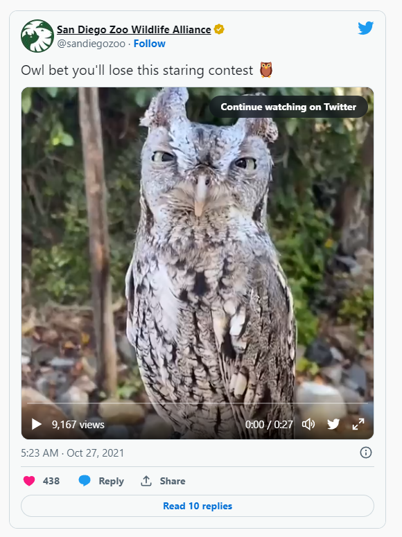

+++
title = "简码"
weight = 9
date = 2023-05-18T17:03:08+08:00
description = ""
isCJKLanguage = true
draft = false
+++

# Shortcodes - 简码

[https://gohugo.io/content-management/shortcodes/](https://gohugo.io/content-management/shortcodes/)

​	简码是在您的内容文件中调用内置或自定义模板的简单代码片段。 

## 什么是简码 

​	Hugo喜欢Markdown，因为它的简单内容格式，但有时Markdown存在局限性。通常，内容作者被迫将原始HTML（例如视频`<iframe>`）添加到Markdown内容中。我们认为这与Markdown语法的美丽简洁相矛盾。

​	Hugo创建了简码来规避这些限制。

​	简码是内容文件中的简单代码片段，Hugo将使用预定义的模板进行渲染。请注意，简码在模板文件中不起作用。如果您需要简码提供的此类插入（drop-in）功能，但在模板中，则很可能需要[局部模板](https://gohugo.io/templates/partials/)。

​	除了更干净的Markdown外，简码可以随时更新以反映新的类、技术或标准。在站点生成的时候，Hugo简码将轻松合并您的更改。您避免了可能复杂的搜索和替换操作。

## 使用简码

<iframe src="https://www.youtube.com/embed/2xkNJL4gJ9E" allowfullscreen="" title="YouTube Video" style="top: 0px; left: 0px; width: 544px; height: 306px; border: 0px;"></iframe>

​	在您的内容文件中，可以通过调用`\{\{\% shortcodename parameters \%\}\}`来调用简码。简码参数由空格分隔，具有内部空格的参数可以用引号引起来。

​	简码声明中的第一个单词始终是简码的名称。参数跟在名称后面。根据简码的定义方式，参数可以是命名的、位置的或两者兼有，但不能在单个调用中混合使用参数类型。命名参数的格式与HTML的格式`name="value"`相似。

​	一些简码使用或需要闭合简码。与HTML一样，开放和关闭简码匹配（仅名称），关闭声明前缀有一个斜杠。

​	以下是成对的简码的两个示例：

```go-html-template
\{\{\% mdshortcode \%\}\}Stuff to `process` in the *center*.\{\{\% /mdshortcode \%\}\}
\{\{\< highlight go \>\}\} A bunch of code here \{\{\< /highlight \>\}\}
```

​	上面的例子使用两个不同的定界符，不同之处在于第一个中有`%`字符，第二个中有`<>`字符。

### 使用原始字符串参数的简码 

​	您可以使用原始字符串字面值将占据多行的参数传递给简码：

```go-html-template
\{\{\<  myshortcode `This is some <b>HTML</b>,
and a new line with a "quoted string".` \>\}\}
```

### 具有 Markdown 的简码 

​	在Hugo 0.55中，我们改变了`%`定界符的工作方式。使用 `%` 作为最外层定界符的简码现在将在发送到内容渲染器时完全渲染。它们可以成为生成的目录（table of contents）、脚注（footnotes）等的一部分。

​	如果您想要旧的行为，可以在简码模板的开头放置以下行：

```go-html-template
\{\{ $_hugo_config := `{ "version": 1 }` \}\}
```

### 没有 Markdown 的简码 

​	`<`字符表示简码的内部内容不需要进一步渲染。通常，不带Markdown的简码包括内部HTML：

```go-html-template
\{\{\< myshortcode \>\}\}<p>Hello <strong>World!</strong></p>\{\{\< /myshortcode \>\}\}
```

### 嵌套的简码 

​	您可以通过创建自己的模板来利用`.Parent变量`在其他简码中调用简码。 `.Parent`允许您检查简码被调用的上下文。请参见[简码模板](https://gohugo.io/templates/shortcode-templates/)。

## 使用 Hugo 的内置简码 

​	Hugo附带了一组预定义的简码，代表非常常见的用法。这些简码提供给作者方便，并使您的Markdown内容保持干净。

### `figure` 

​	`figure` 是 Markdown 中图像语法的扩展，它不提供更语义化的 [HTML5 <figure> 元素](https://html5doctor.com/the-figure-figcaption-elements/)的简写形式。

​	`figure`简码可以使用以下命名参数：

- src

  要显示的图像的URL。 

- link

  如果图像需要超链接，目标的URL。 

- target

  如果设置了`link`参数，则为URL的可选`target`属性。 

- rel

  如果设置了`link`参数，则为URL的可选`rel`属性。 

- alt

  如果无法显示图像，则为图像的替代文本。 

- title

  图像标题。 

- caption

  图像标题。在`caption`的值中的Markdown将被渲染。 

- class

  HTML `figure`标记的`class`属性。 

- height

  图像的`height`属性。 

- width

  图像的`width`属性。 

- attr

  图像归属文本。在`attr`的值中的Markdown将被渲染。 

- attrlink

  如果需要将归属文本超链接，则为目标的URL。 

#### 示例`figure`输入 

figure-input-example.md

```md
\{\{\< figure src="elephant.jpg" title=">An elephant at sunset" \>\}\}
```

#### 示例`figure`输出

```html
<figure>
  
  <figcaption>An elephant at sunset</figcaption>
</figure>
```

### `gist` 

​	要显示此URL的GitHub代码片段（[gist](https://docs.github.com/en/get-started/writing-on-github/editing-and-sharing-content-with-gists)）：

```text
https://gist.github.com/user/50a7482715eac222e230d1e64dd9a89b
```

​	在您的Markdown中包含以下内容：

```text
\{\{\< gist user 50a7482715eac222e230d1e64dd9a89b \>\}\}
```

​	这将按文件名按字母顺序显示gist中的所有文件。

```html
{{ with .GetTerms "tags" }}
  <ul>
    {{ range . }}
      <li><a href="{{ .RelPermalink }}">{{ .LinkTitle }}</a></li>
    {{ end }}
  </ul>
{{ end }}
<ul>
  <li><a href="/tags/tag-a/">Tag A</a></li>
  <li><a href="/tags/tab-b/">Tab B</a></li>
  <li><a href="/tags/tab-c/">Tab C</a></li>
</ul>
```

​	要显示gist中的特定文件：

```text
\{\{\< gist user 50a7482715eac222e230d1e64dd9a89b 1-template.html \>\}\}
```

​	渲染结果：

```html
{{ with .GetTerms "tags" }}
  <ul>
    {{ range . }}
      <li><a href="{{ .RelPermalink }}">{{ .LinkTitle }}</a></li>
    {{ end }}
  </ul>
{{ end }}
```

### `highlight` 

​	用于展示高亮代码示例：

```text
\{\{\< highlight go-html-template \>\}\}
{{ range .Pages }}
  <h2><a href="{{ .RelPermalink }}">{{ .LinkTitle }}</a></h2>
{{ end }}
\{\{\< /highlight \>\}\}
```

​	渲染结果：

```go-html-template
{{ range .Pages }}
  <h2><a href="{{ .RelPermalink }}">{{ .LinkTitle }}</a></h2>
{{ end }}
```

​	若要指定一个或多个[高亮选项](https://gohugo.io/functions/highlight/)，请使用引号包围、逗号分隔的列表：

```text
\{\{\< highlight go-html-template "lineNos=inline, lineNoStart=42" \>\}\}
{{ range .Pages }}
  <h2><a href="{{ .RelPermalink }}">{{ .LinkTitle }}</a></h2>
{{ end }}
\{\{\< /highlight \>\}\}
```

​	渲染结果：

```go-html-template
42{{ range .Pages }}
43  <h2><a href="{{ .RelPermalink }}">{{ .LinkTitle }}</a></h2>
44{{ end }}
```

### `instagram` 

​	`instagram`简码使用Facebook的**oEmbed Read**功能。Facebook[开发者文档](https://developers.facebook.com/docs/features-reference/oembed-read)说明：

- 这个权限或特性需要App Review流程成功完成，然后您的应用才能访问实时数据。[了解更多](https://developers.facebook.com/docs/app-review) 
- 此权限或功能仅在业务验证后才可用。在应用访问数据之前，您可能还需要签署其他合同。[在此处了解更多](https://developers.facebook.com/docs/development/release/business-verification) 

​	您必须获得Access Token才能使用`instagram` 简码。

​	如果您的站点配置是私有的：

config.

=== "yaml"

    ``` yaml
    services:
      instagram:
        accessToken: xxx
    ```

=== "toml"

    ``` toml
    [services]
      [services.instagram]
        accessToken = 'xxx'
    ```

=== "json"

    ``` json
    {
       "services": {
          "instagram": {
             "accessToken": "xxx"
          }
       }
    }
    ```


​	如果您的站点配置不是私有的，请使用环境变量设置 Access Token：

```text
HUGO_SERVICES_INSTAGRAM_ACCESSTOKEN=xxx hugo --gc --minify
```

> ​	如果您正在使用Client Access Token，您必须使用管道符（`APPID|ACCESSTOKEN`）将Access Token与您的App ID 结合起来。

​	要显示具有此 URL 的 Instagram 帖子：

```text
https://www.instagram.com/p/BWNjjyYFxVx/
```

​	在您的 Markdown 中包含以下内容：

```text
\{\{\< instagram BWNjjyYFxVx \>\}\}
```

### `param` 

​	从当前页面的前置元数据中的 params 集合获取一个值，并回退到站点参数值。如果在其中都找不到具有给定键的参数，则会记录一个 `ERROR`。

```bash
\{\{\< param testparam \>\}\}
```

​	由于 `testparam` 是此页面前置元数据中定义的参数，其值为 `Hugo Rocks!`，因此以上内容将打印出：

Hugo Rocks!

​	要访问深层嵌套的参数，请使用"点语法"，例如：

```bash
\{\{\< param "my.nested.param" \>\}\}
```

### `ref` 和`relref` 

​	这些简码将通过相对路径（例如`blog/post.md`）或逻辑名称（`post.md`）查找页面，并返回找到的页面的永久链接（`ref` 即 permalink ）或相对永久链接（`relref` 即 relative permalink）。

​	`ref`和`relref`还使得可以为Hugo生成的标题链接创建片段链接（fragmentary link）。

> ​	在[交叉引用文档](https://gohugo.io/content-management/cross-references/)中阅读有关 `ref` 和 `relref` 的更详细描述。

​	`ref` 和 `relref` 接受恰好一个必需的引用参数，引用参数必须在位置 `0` 上引用并使用引号引起来。

#### 示例`ref`和`relref`输入 

```go-html-template
[Neat](\{\{\< ref "blog/neat.md" \>\}\})
[Who](\{\{\< relref "about.md#who" \>\}\})
```

#### 示例`ref`和`relref`输出 

​	假设标准的 Hugo 美化 URL 已经开启。

```html
<a href="https://example.com/blog/neat">Neat</a>
<a href="/about/#who">Who</a>
```

### `tweet` 

​	要显示此URL的Twitter帖子：

```txt
https://twitter.com/SanDiegoZoo/status/1453110110599868418
```

​	请在您的Markdown 中包含以下内容：

```text
\{\{\< tweet user="SanDiegoZoo" id="1453110110599868418" \>\}\}
```

​	渲染结果：




### `vimeo` 

​	要显示此 URL 的 Vimeo 视频：

```text
https://vimeo.com/channels/staffpicks/55073825
```

​	请在您的Markdown 中包含以下内容：

```text
\{\{\< vimeo 55073825 \>\}\}
```

​	渲染结果：

<iframe src="https://player.vimeo.com/video/55073825" title="vimeo video" webkitallowfullscreen="" mozallowfullscreen="" allowfullscreen="" style="top: 0px; left: 0px; width: 544px; height: 306px; border: 0px;"></iframe>

> ​	如果您想进一步自定义 YouTube 或 Vimeo 输出的视觉样式，请在调用简码时添加一个名为 `class` 的参数。新的`class`将添加到包裹 `<iframe>` 的 `<div>` 中，并删除其内联样式。请注意，您还需要将`id`作为命名参数调用。您还可以使用 `title` 为 Vimeo 视频添加描述性标题。
>
> ```go
> \{\{\< vimeo id="146022717" class="my-vimeo-wrapper-class" title="My vimeo video" \>\}\}
> ```


### `youtube` 

​	`youtube` 简码为 [YouTube 视频](https://www.youtube.com/)嵌入一个响应式视频播放器。仅需要视频的 ID，例如：

```txt
https://www.youtube.com/watch?v=w7Ft2ymGmfc
```

#### 示例 `youtube` 输入 

​	复制视频 URL 中 `v=` 后面的 YouTube 视频 ID 并将其传递给 `youtube` 简码：

example-youtube-input.md

```md
\{\{\< youtube w7Ft2ymGmfc \>\}\}
```

​	此外，您可以将嵌入视频的`autoplay` 参数设置为 `true`，以自动开始播放。请记住，您不能混合使用命名和未命名参数，因此您需要将未命名的视频 ID 分配给 `id` 参数：

example-youtube-input-with-autoplay.md

```md
\{\{\< youtube id="w7Ft2ymGmfc" autoplay="true" \>\}\}
```

​	出于[辅助功能的原因](https://dequeuniversity.com/tips/provide-iframe-titles)，最好为您的 YouTube 视频提供一个标题。您可以使用 `title` 参数为简码提供标题。如果没有提供标题，将使用默认标题"YouTube Video"。

example-youtube-input-with-title.md

```md
\{\{\< youtube id="w7Ft2ymGmfc" title="A New Hugo Site in Under Two Minutes" \>\}\}
```

#### 示例 `youtube` 输出 

​	使用上述 `youtube` 示例，将添加以下 HTML 到您的站点的标记中：

example-youtube-output.html

```go-html-template
<div style="position: relative; padding-bottom: 56.25%; height: 0; overflow: hidden;">
  <iframe src="https://www.youtube.com/embed/w7Ft2ymGmfc?autoplay=1" style="position: absolute; top: 0; left: 0; width: 100%; height: 100%; border:0;" allowfullscreen title="YouTube Video"></iframe>
</div>
```

#### 示例 `youtube` 显示  

**	使用上述 `youtube` 示例（不带 `autoplay="true"`），以下是访问者在您的站点上看到的内容。当然，最终的显示将取决于您的样式表和周围的标记。该视频也包含在 [Hugo 文档的快速入门](https://gohugo.io/getting-started/quick-start/)中。

<iframe src="https://www.youtube.com/embed/w7Ft2ymGmfc" allowfullscreen="" title="YouTube Video" style="top: 0px; left: 0px; width: 544px; height: 306px; border: 0px;"></iframe>

## 隐私配置 

​	要了解如何配置您的Hugo站点以满足新的欧盟隐私法规，请参阅[Hugo和GDPR](https://gohugo.io/about/hugo-and-gdpr/)。

## 创建自定义简码 

​	要了解更多有关创建自定义简码的信息，请参阅[简码模板文档](https://gohugo.io/templates/shortcode-templates/)。

## 另请参阅 

- [Hugo和《通用数据保护条例》（GDPR） ](https://gohugo.io/about/hugo-and-gdpr/)
- [创建您自己的简码 ](https://gohugo.io/templates/shortcode-templates/)
- [markdownify](https://gohugo.io/functions/markdownify/)
- [.Get](https://gohugo.io/functions/get/)
- [.RenderString](https://gohugo.io/functions/renderstring/)
