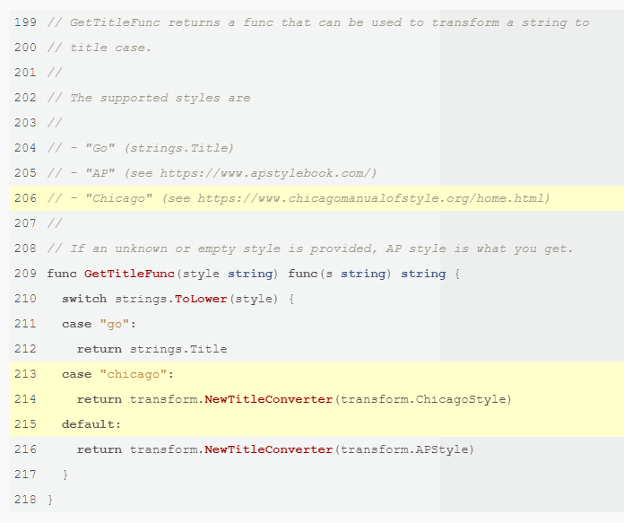

+++
title = "语法高亮"
weight = 27
date = 2023-05-18T17:03:08+08:00
description = ""
isCJKLanguage = true
draft = false
+++

# Syntax Highlighting- 语法高亮 

[https://gohugo.io/content-management/syntax-highlighting/](https://gohugo.io/content-management/syntax-highlighting/)

​	Hugo 使用来自 Chroma 的非常快速的语法高亮功能。 

​	Hugo 使用 [Chroma](https://github.com/alecthomas/chroma)作为其代码高亮器；它是使用 Go 构建的，非常非常快。

## 配置语法高亮器 

​	参见 [配置高亮](https://gohugo.io/getting-started/configuration-markup#highlight)。

## 生成语法高亮器 CSS 

​	如果在站点配置中运行时使用了 `markup.highlight.noClasses=false`，则需要一个样式表。

​	您可以使用Hugo生成样式表：

```bash
hugo gen chromastyles --style=monokai > syntax.css
```

​	运行`hugo gen chromastyles -h`以获取更多选项。请参阅[https://xyproto.github.io/splash/docs/](https://xyproto.github.io/splash/docs/)以获取可用样式的库。

## 高亮简码 

​	通过内置的[`highlight` shortcode](https://gohugo.io/content-management/shortcodes/#highlight)进行高亮显示。它需要一个必需的参数来指定编程语言，并需要一个闭合shortcode。

选项：

- `linenos`：配置行号。有效值为 `true`、`false`、`table` 或 `inline`。如果在站点配置中配置了行号，则 `false` 将关闭行号。`table` 将提供可复制和粘贴的代码块。
- `hl_lines`：列出要高亮显示的一组行号或行号范围。
- `linenostart=199`：从 199 开始计数行号。
- `anchorlinenos`：配置行号上的锚点。有效值为 `true` 或 `false`；
- `lineanchors`：为行号配置前缀。将添加后缀`-`，因此在选项`lineanchors=prefix`下将第1行链接到页面时，将向页面添加锚`prefix-1`。
- `hl_inline` 在 `<code>`（内联 HTML 元素）标记内部进行高亮。有效值为 `true` 或 `false`。`code` 标记将获得一个名为 `code-inline` 的类。[v0.101.0 中新增](https://github.com/gohugoio/hugo/releases/tag/v0.101.0)。 

### 示例：Highlight Shortcode

```go-html-template
\{\{\< highlight go "linenos=table,hl_lines=8 15-17,linenostart=199" \>\}\}
// ... code
\{\{\< / highlight \>\}\}
```

得到的结果如下：



## 高亮 Hugo/GO 模板代码

​	为了在页面上突出显示Hugo/GO模板代码，在双大括号的开头添加`/*`，在右大括号前添加`*/`。

```go
\{\{\</* myshortcode */\>\}\}
```

得到的结果如下：

```go
\{\{\< myshortcode \>\}\}
```

## 高亮模板函数 

​	请参见[Highlight](https://gohugo.io/functions/highlight/)。

## Highlighting in Code Fences 

​	默认情况下，代码框中的高亮显示已启用。

~~~txt
```go {linenos=table,hl_lines=[8,"15-17"],linenostart=199}
// ... code
```
~~~

得到的结果如下：


​	这些选项与[高亮简码](https://gohugo.io/content-management/syntax-highlighting/#highlight-shortcode)中的选项相同，包括 `linenos=false`，但请注意略有不同的 Markdown 属性语法。

## Chroma 高亮显示语言列表 

​	以下是Chroma词法分析器及其别名的完整列表（这些别名是在`highlight`模板函数或在代码框中使用的标识符）：

- ABAP

  abap

- ABNF

  abnf

- ActionScript

  as, actionscript

- ActionScript 3

  as3, actionscript3

- Ada

  ada, ada95, ada2005

- AL

  al

- Angular2

  ng2

- ANTLR

  antlr

- ApacheConf

  apacheconf, aconf, apache

- APL

  apl

- AppleScript

  applescript

- Arduino

  arduino

- ArmAsm

  armasm

- Awk

  awk, gawk, mawk, nawk

- Ballerina

  ballerina

- Bash

  bash, sh, ksh, zsh, shell

- BashSession

  bash-session, console, shell-session

- Batchfile

  bat, batch, dosbatch, winbatch

- BibTeX

  bib, bibtex

- Bicep

  bicep

- BlitzBasic

  blitzbasic, b3d, bplus

- BNF

  bnf

- BQN

  bqn

- Brainfuck

  brainfuck, bf

- C

  c

- C#

  csharp, c#

- C++

  cpp, c++

- Caddyfile

  caddyfile, caddy

- Caddyfile Directives

  caddyfile-directives, caddyfile-d, caddy-d

- Cap'n Proto

  capnp

- Cassandra CQL

  cassandra, cql

- Ceylon

  ceylon

- CFEngine3

  cfengine3, cf3

- cfstatement

  cfs

- ChaiScript

  chai, chaiscript

- Chapel

  chapel, chpl

- Cheetah

  cheetah, spitfire

- Clojure

  clojure, clj

- CMake

  cmake

- COBOL

  cobol

- CoffeeScript

  coffee-script, coffeescript, coffee

- Common Lisp

  common-lisp, cl, lisp

- Common Lisp

  common-lisp, cl, lisp

- Coq

  coq

- Crystal

  cr, crystal

- CSS

  css

- Cython

  cython, pyx, pyrex

- D

  d

- Dart

  dart

- Diff

  diff, udiff

- Django/Jinja

  django, jinja

- dns

  zone, bind

- Docker

  docker, dockerfile

- DTD

  dtd

- Dylan

  dylan

- EBNF

  ebnf

- Elixir

  elixir, ex, exs

- Elm

  elm

- EmacsLisp

  emacs, elisp, emacs-lisp

- EmacsLisp

  emacs, elisp, emacs-lisp

- Erlang

  erlang

- Factor

  factor

- Fennel

  fennel, fnl

- Fish

  fish, fishshell

- Forth

  forth

- Fortran

  fortran, f90

- FortranFixed

  fortranfixed

- FSharp

  fsharp

- GAS

  gas, asm

- GDScript

  gdscript, gd

- Genshi

  genshi, kid, xml+genshi, xml+kid

- Genshi HTML

  html+genshi, html+kid

- Genshi Text

  genshitext

- Gherkin

  cucumber, Cucumber, gherkin, Gherkin

- GLSL

  glsl

- Gnuplot

  gnuplot

- Go

  go, golang

- Go HTML Template

  go-html-template

- Go HTML Template

  go-html-template

- Go Text Template

  go-text-template

- GraphQL

  graphql, graphqls, gql

- Groff

  groff, nroff, man

- Groovy

  groovy

- Handlebars

  handlebars, hbs

- Haskell

  haskell, hs

- Haxe

  hx, haxe, hxsl

- HCL

  hcl

- Hexdump

  hexdump

- HLB

  hlb

- HLSL

  hlsl

- HTML

  html

- HTTP

  http

- Hy

  hylang

- Idris

  idris, idr

- Igor

  igor, igorpro

- INI

  ini, cfg, dosini

- Io

  io

- J

  j

- Java

  java

- JavaScript

  js, javascript

- JSON

  json

- Julia

  julia, jl

- Jungle

  jungle

- Kotlin

  kotlin

- Lighttpd configuration file

  lighty, lighttpd

- LLVM

  llvm

- Lua

  lua

- Makefile

  make, makefile, mf, bsdmake

- Mako

  mako

- markdown

  md, mkd

- Mason

  mason

- Mathematica

  mathematica, mma, nb

- Matlab

  matlab

- mcfunction

  mcfunction

- Meson

  meson, meson.build

- Metal

  metal

- MiniZinc

  minizinc, MZN, mzn

- MLIR

  mlir

- Modula-2

  modula2, m2

- MonkeyC

  monkeyc

- MorrowindScript

  morrowind, mwscript

- Myghty

  myghty

- MySQL

  mysql, mariadb

- NASM

  nasm

- Newspeak

  newspeak

- Nginx configuration file

  nginx

- Nim

  nim, nimrod

- Nix

  nixos, nix

- Objective-C

  objective-c, objectivec, obj-c, objc

- OCaml

  ocaml

- Octave

  octave

- OnesEnterprise

  ones, onesenterprise, 1S, 1S:Enterprise

- OpenEdge ABL

  openedge, abl, progress, openedgeabl

- OpenSCAD

  openscad

- Org Mode

  org, orgmode

- PacmanConf

  pacmanconf

- Perl

  perl, pl

- PHP

  php, php3, php4, php5

- PHTML

  phtml

- Pig

  pig

- PkgConfig

  pkgconfig

- PL/pgSQL

  plpgsql

- plaintext

  text, plain, no-highlight

- Plutus Core

  plutus-core, plc

- Pony

  pony

- PostgreSQL SQL dialect

  postgresql, postgres

- PostScript

  postscript, postscr

- POVRay

  pov

- PowerQuery

  powerquery, pq

- PowerShell

  powershell, posh, ps1, psm1, psd1, pwsh

- Prolog

  prolog

- PromQL

  promql

- properties

  java-properties

- Protocol Buffer

  protobuf, proto

- PSL

  psl

- Puppet

  puppet

- Python

  python, py, sage, python3, py3

- Python 2

  python2, py2

- QBasic

  qbasic, basic

- QML

  qml, qbs

- R

  splus, s, r

- Racket

  racket, rkt

- Ragel

  ragel

- Raku

  perl6, pl6, raku

- react

  jsx, react

- ReasonML

  reason, reasonml

- reg

  registry

- reStructuredText

  rst, rest, restructuredtext

- Rexx

  rexx, arexx

- Ruby

  rb, ruby, duby

- Rust

  rust, rs

- SAS

  sas

- Sass

  sass

- Scala

  scala

- Scheme

  scheme, scm

- Scilab

  scilab

- SCSS

  scss

- Sed

  sed, gsed, ssed

- Sieve

  sieve

- Smalltalk

  smalltalk, squeak, st

- Smarty

  smarty

- Snobol

  snobol

- Solidity

  sol, solidity

- SPARQL

  sparql

- SQL

  sql

- SquidConf

  squidconf, squid.conf, squid

- Standard ML

  sml

- stas

  

- Stylus

  stylus

- Svelte

  svelte

- Swift

  swift

- SYSTEMD

  systemd

- systemverilog

  systemverilog, sv

- TableGen

  tablegen

- TASM

  tasm

- Tcl

  tcl

- Tcsh

  tcsh, csh

- Termcap

  termcap

- Terminfo

  terminfo

- Terraform

  terraform, tf

- TeX

  tex, latex

- Thrift

  thrift

- TOML

  toml

- TradingView

  tradingview, tv

- Transact-SQL

  tsql, t-sql

- Turing

  turing

- Turtle

  turtle

- Twig

  twig

- TypeScript

  ts, tsx, typescript

- TypoScript

  typoscript

- TypoScriptCssData

  typoscriptcssdata

- TypoScriptHtmlData

  typoscripthtmldata

- V

  v, vlang

- V shell

  vsh, vshell

- Vala

  vala, vapi

- VB.net

  vb.net, vbnet

- verilog

  verilog, v

- VHDL

  vhdl

- VHS

  vhs, tape, cassette

- VimL

  vim

- vue

  vue, vuejs

- WDTE

  

- Whiley

  whiley

- XML

  xml

- Xorg

  xorg.conf

- YAML

  yaml

- YANG

  yang

- Zed

  zed

- Zig

  zig

## 另请参阅

- [highlight](https://gohugo.io/functions/highlight/)
- [配置标记](https://gohugo.io/getting-started/configuration-markup/)
