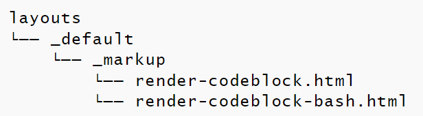

+++
title = "Markdown渲染钩子"
weight = 5
date = 2023-05-18T17:03:08+08:00
description = ""
isCJKLanguage = true
draft = false
+++

# Markdown Render Hooks - Markdown渲染钩子 

https://gohugo.io/templates/render-hooks/

​	渲染钩子允许自定义模板覆盖markdown渲染功能。

​	请注意，这只支持[Goldmark]([Goldmark](https://gohugo.io/getting-started/configuration-markup#goldmark))渲染器。

​	您可以通过在`layouts/_default/_markup`中创建名称为`render-{kind}`的模板来覆盖默认的Markdown渲染为HTML的某些部分。

​	您还可以在`layouts/[type/section]/_markup`中创建特定于type/section的钩子，例如：`layouts/blog/_markup`。

​	目前支持的钩子种类有：

- `image`
- `link`
- `heading`
- `codeblock` [New in v0.93.0](https://github.com/gohugoio/hugo/releases/tag/v0.93.0)

​	如果需要，您可以定义特定于[输出格式](https://gohugo.io/templates/output-formats)和[语言](https://gohugo.io/content-management/multilingual/)的模板。您的`layouts`文件夹可能如下所示：

```text
layouts/
└── _default/
    └── _markup/
        ├── render-codeblock-bash.html
        ├── render-codeblock.html
        ├── render-heading.html
        ├── render-image.html
        ├── render-image.rss.xml
        └── render-link.html
```

​	以下是上述用法的一些示例：

- 使用`.GetPage`解析链接引用。这将使链接可移植，因为您可以将`./my-post.md`（和在GitHub上可以使用的类似构造）转换为`/blog/2019/01/01/my-post/`等。 
- 为外部链接添加`target=_blank`。 
- 解析和[处理](https://gohugo.io/content-management/image-processing/)图像。 
- 添加[标题链接](https://remysharp.com/2014/08/08/automatic-permalinks-for-blog-posts)。

## 渲染钩子应用于标题、链接和图像 

### 传递给`render-link`和`render-image`的上下文 

​	`render-link`和`render-image`模板将接收到以下上下文：

- Page

  正在被渲染的[Page](https://gohugo.io/variables/page/)。 

- Destination

  The URL.

- Title

  title属性。 

- Text

  渲染后的（HTML）链接文本。 

- PlainText

  上述文本的纯文本版本。

### 传递给`render-heading`的上下文 

​	`render-heading`模板将接收以下上下文：

- Page

  正在被渲染的[页面](https://gohugo.io/variables/page/)。 

- Level

  标题级别（1-6） 

- Anchor

  在该页面中唯一的自动生成的HTML id。 

- Text

  被渲染后的（HTML）文本。 

- PlainText

  上述内容的纯文本版本。 

- Attributes (map)

  一个属性映射（例如`id`、`class`）。需要注意的是，对于链接，这个映射目前始终为空。 

The `render-image` templates will also receive:

​	`render-image`模板还将接收：

- IsBlock [New in v0.108.0](https://github.com/gohugoio/hugo/releases/tag/v0.108.0)

  如果这是一个独立的图像并且配置选项[markup.goldmark.parser.wrapStandAloneImageWithinParagraph](https://gohugo.io/getting-started/configuration-markup/#goldmark)被禁用，则返回true。

- Ordinal [New in v0.108.0](https://github.com/gohugoio/hugo/releases/tag/v0.108.0)

  当前文档中所有图像的基于零的序数。 

### 带标题的Markdown链接示例 

```md
[Text](https://www.gohugo.io "Title")
```

​	以下是render-link.html模板的代码示例：

`layouts/_default/_markup/render-link.html`

```go-html-template
<a href="{{ .Destination | safeURL }}"{{ with .Title }} title="{{ . }}"{{ end }}{{ if strings.HasPrefix .Destination "http" }} target="_blank" rel="noopener"{{ end }}>{{ .Text | safeHTML }}</a>
```

### 图像Markdown示例 

```md

```

​	以下是render-image.html模板的代码示例：

`layouts/_default/_markup/render-image.html`

```go-html-template
<p class="md__image">
  
</p>
```

### 标题链接示例  

​	给定此模板文件

`layouts/_default/_markup/render-heading.html`

```go-html-template
<h{{ .Level }} id="{{ .Anchor | safeURL }}">{{ .Text | safeHTML }} <a href="#{{ .Anchor | safeURL }}">¶</a></h{{ .Level }}>
```

​	以及这个 markdown

```md
### Section A
```

​	渲染出的 HTML 代码将是

```html
<h3 id="section-a">Section A <a href="#section-a">¶</a></h3>
```

## 代码块的渲染钩子  

[New in v0.93.0](https://github.com/gohugoio/hugo/releases/tag/v0.93.0)

​	您可以为所有代码块或特定类型/语言（例如下面的`bash`）添加钩子模板：



​	这些代码块的默认行为是进行[代码高亮](https://gohugo.io/content-management/syntax-highlighting/#highlighting-in-code-fences)，但是由于可以向这些代码块传递属性，因此它们可以用于几乎任何事情。一个示例是内置的[GoAT Diagrams](https://gohugo.io/content-management/diagrams/#goat-diagrams-ascii)或这个[Mermaid Diagram Code Block Hook](https://gohugo.io/content-management/diagrams/#mermaid-diagrams)示例。

​	代码块模板中您可以获取到的上下文（"."）包括：

- Type (string)

  代码块的类型。这将是编程语言，例如`bash`，用于进行代码高亮。 

- Attributes (map)

  从Markdown传递的属性（例如`{ attrName1=attrValue1 attrName2="attr Value 2" }`）。 

- Options (map)

  Chroma 高亮处理选项。仅在 `Type` 是已知的 [Chroma Lexer](https://gohugo.io/content-management/syntax-highlighting/#list-of-chroma-highlighting-languages) 时才填充。 

- Inner (string)

  代码围栏之间的文本。 

- Ordinal (integer)

  当前文档中所有代码块的从零开始的序数。 

- Page

  所属的`Page`。 

- Position

  在错误日志中有用，因为它会打印出文件名和位置（行号、列号），例如 `{{ errorf "error in code block: %s" .Position }}`。 

## 另请参阅 

- [.RenderString](https://gohugo.io/functions/renderstring/)
- [内容格式 (https://gohugo.io/content-management/formats/)
- [简码](https://gohugo.io/content-management/shortcodes/)
- [anchorize](https://gohugo.io/functions/anchorize/)
- [markdownify](https://gohugo.io/functions/markdownify/)
